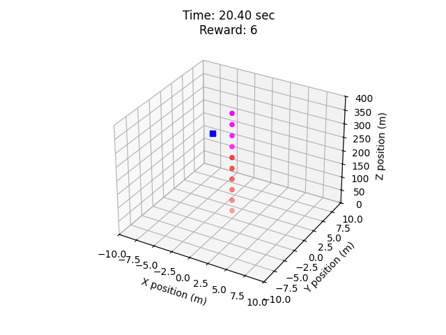

# Balloon Popping Challenge: A 6-DoF Rocket GNC Simulation [Gymnasium](https://gymnasium.farama.org/) Environment

This repository contains the code for the Balloon Popping Challenge, a 6-DoF rocket guidance, navigation, and control (GNC) simulation environment built using [Gymnasium](https://gymnasium.farama.org/). The environment is designed to simulate an active controlled rocket to pop balloons scattered in the sky. The simulator incorporates realistic physics, including atmospheric conditions and rocket dynamics, to provide a challenging platform for developing and testing GNC algorithms. This project is based on [ActiveRocketPy](https://github.com/ARRC-Rocket/ActiveRocketPy), a fork of open-source software [RocketPy](https://github.com/RocketPy/RocketPy). 

## Installation

```shell
git clone https://github.com/ARRC-Rocket/BalloonPoppingChallenge.git
cd BalloonPoppingChallenge
git submodule update --init # Initialize the ActiveRocketPy submodule
python -m venv .venv        # Create a virtual environment (optional but recommended)
.venv\Scripts\activate      # On Windows
# source .venv/bin/activate # On Unix or MacOS
python -m pip install -r requirements.txt
```

## Update from the repository:

```shell
cd BalloonPoppingChallenge
git pull origin main
git submodule update --remote --merge
```

## Examples

1. Evaluate agent:
    - Develop the agent in [/agents folder](./BalloonPoppingGymEnv/agents) by inheriting from [BaseAgent](./BalloonPoppingGymEnv/agents/base_agent.py) and implementing the `get_action` method.
    - Update the evaluation configuration file in [/evaluation/configs folder](./BalloonPoppingGymEnv/evaluation/configs) to specify the scenario parameters and the agent to be evaluated.
    - Run:
        ```shell
        cd BalloonPoppingChallenge
        python .\BalloonPoppingGymEnv\evaluation\evaluate.py .\BalloonPoppingGymEnv\evaluation\configs\example_eval_cfg.yaml
        ```
    - You should see a rocket popping static balloons in the sky:
        

2. Example code for development and debugging:
    - Run the example script:
        ```shell
        cd BalloonPoppingChallenge
        python .\doc\examples\run_env_agent.py
        ```
    - This will run the specified scenario with the example agent and print the final reward. You can modify the agent, scenario parameters, and other settings in the script for development and debugging purposes.

## Modelling Details
- Rocket flight modelling (RocketPy):
    - The details can be found in the [RocketPy Reference](https://docs.rocketpy.org/en/latest/index.html)
    - The coordinates are shown in the figure below:
    
- Balloon popping specific modelling:
    - Balloons are modeled as spheres with a certain radius and mass.
    - Balloon flights are simulated using [Monte-Carlo simulation](./ActiveRocketPy/rocketpy/simulation/monte_carlo.py) method provided by ActiveRocketPy. To use the [Flight](./ActiveRocketPy/rocketpy/simulation/flight.py) class of ActiveRocketPy, a small solid motor will push the balloon out-of rail. The balloon will then fly freely under the influence of gravity, buoyancy, wind, and atmospheric drag.
    - The flight of each balloon is not affected by the rocket or other balloons.
    - A balloon is considered popped if the distance between the path of the rocket (center of dry mass) and the center of balloon within a timestep is less than the radius of the balloon.
    - Balloons release will be determined depends on the scenario parameters.
    - There will be a single launch, and the aim is to pop as many balloons as possible.
    - Launch time, inclination, and heading are determined by the agent.
    - There will be disturbances, e.g., sensor noise, wind in the environment.

## Gymnasium Environment Operation
There are three stages in the operation of the Gymnasium environment: reset, stepping, and termination.
1. **Reset**: The environment is reset using `env.reset()`, which sets up the initial conditions for the rocket and balloons as given in the [scenario_0_parameter.yaml](./BalloonPoppingGymEnv/envs/scenario_parameters/scenario_0_parameters.yaml) files. The trajectory of each balloon is simulated using the [monte-carlo simulation of ActiveRocketPy](./ActiveRocketPy/rocketpy/simulation/monte_carlo.py) then stored in the environment.

2. **Stepping**: The agent takes an action (e.g., launch, roll, throttle and TVC commands) and calls `env.step(action)`, which advances the simulation by one time step. The environment returns the new observations, reward, termination flag, and additional info.

3. **Termination**: The episode ends when maximum simulation time is reached or the rocket hits the ground. The environment provides a reward based on the number of balloons popped.

The actions, observations, info, rewards in this environment are:
- actions:
    - `launch`: a binary command to launch the rocket.
    - `launch_inclination_heading`: a 2-element array [inclination, heading] representing the launch inclination (0-90 degrees from horizontal) and heading angles (0-360 degrees from north).
    - `tvc`: a 2-element array [TVC_x, TVC_y] representing the thrust vector control (TVC) gimbal angles (deg). Polarity: positive gimbal angles provide positive torques.
    - `throttle`: a scalar representing the throttle ratio between 0 and 1.
    - `roll`: a scalar representing the roll torque command in N-m.
- observations:
    - `simulation_time`: the current simulation time in seconds.
    - `balloon_status`: a n-element array representing the status of each balloon (0: on the ground, 1: released, 2: popped). n is the number of balloons in the scenario.
    - `balloon_states`: a n x 6 array representing the position (posX, posY, posZ) and velocity (velX, velY, velZ) of each balloon.
        - Position is in the launch frame (relative to launch origin) in meters.
        - Velocity is in the launch frame (relative to launch origin) in m/s.
    - `rocket_sensors`: a 12-element array representing the rocket's sensor measurements (gyroX, gyroY, gyroZ, accX, accY, accZ, posX, posY, posZ, velX, velY, velZ). Orientation of inertial sensors matches body frame.
        - Gyroscopes measure the angular velocity (rad/s) in the rocket body frame.
        - Accelerometers measure the linear acceleration (m/s²) in the rocket body frame.
        - GNSS sensors measure the position (m) and velocity (m/s) in the launch frame (relative to launch origin).
    - Note that the rocket's true states (e.g., attitude, angular velocity) are not directly observed by the agent, and the agent needs to infer them from the sensor measurements.
- info:
    - `rocket_states`: a 13-element array representing the rocket's true states. These states are not observed and should not be used by the agent but can be used for development and debugging. The states are [posX, posY, posZ, velX, velY, velZ, e0, e1, e2, e3, wX, wY, wZ]:
        - pos: position in the launch frame (relative to launch origin) in meters.
        - vel: velocity in the launch frame (relative to launch origin) in m/s.
        - e: quaternion representing the attitude of the rocket (e0, e1, e2, e3) relative to the launch frame.
        - w: angular velocity in the rocket body frame in rad/s.

- rewards:
    - The reward is calculated based on the number of balloons popped at each time step.

## Agent Development
Agents for evaluation are placed in the [/agents folder](./BalloonPoppingGymEnv/agents). They should be implemented as a class that inherits from [BaseAgent](./BalloonPoppingGymEnv/agents/base_agent.py) and implements the `get_action` method. The agent can access the scenario parameters through `self.given_parameters`, as defined in `scenario_given_parameters.yaml` files in [/scenario_parameters folder](./BalloonPoppingGymEnv/envs/scenario_parameters/). Observations are passed throught the `get_action` method. The agent should output an action dictionary that matches the action space defined in the environment.

## Evaluation details

The evaluation script is located in [/evaluation folder](./BalloonPoppingGymEnv/evaluation). It takes a configuration file as input, which specifies the scenario parameters and the agent to be evaluated. The script runs the specified scenario with the given agent and outputs the results.


## Reference
- [RocketPy GitHub](https://github.com/RocketPy/RocketPy)
- [RocketPy Documentation](https://docs.rocketpy.org/en/latest/index.html)
- [Gymnasium Documentation](https://gymnasium.farama.org/)

___
___

## Balloon Popping Challenge @ TASTI 2026

*An International Rocket GNC Software Design Competition*

__Develop your own Python software to guide, navigate, and control a rocket to pop balloons in the sky.__

This is the official code repository for the Balloon Popping Challenge, a competition held at the Taiwan International Assembly of Space Science, Technology, and Industry (TASTI) 2026.

This competition aims to cultivate next-generation talent in rocket Guidance, Navigation, and Control (GNC) by engaging participants in the development of autonomous flight control algorithms.
Participants are required to develop Python-based software to autonomously control a simulated rocket. Within a physics-based simulation environment, the rocket must navigate and pop balloons released dynamically to maximize the number of pops under uncertain conditions.

Keywords: GNC, autonomous rocket, optimization, path-finding.

### Competition Details
- Sign up for the competition: `[TASTI 2026 Registration]()`
- Competition timeline: 
    - **Apr dd, 2026**: Competition announcement, open applications, beta release of rules and software
    - **May - Aug, 2026**: Release software updates, update rules, hold monthly meetings, online leader boards
    - **Aug dd, 2026**: Release final software and rules, close applications
    - **Sep dd, 2026**: Online elimination rounds
    - **Oct dd, 2026**: Announce finalists
    - **Nov dd, 2026 @ TASTI**: Finalist presentations and live demos (<2 hours total)

### Competition Rules

- The participant will develop agents in [/agents folder](./BalloonPoppingGymEnv/agents/) to control a rocket.
- The agent should only take the observations provided by the environment and output control commands (e.g., launch, roll, throttle and TVC commands) at each time step. The agent should not have access to any other information about the environment or the simulator.
- Other than the agent, all other components of the simulator are fixed and provided by the organizer. Participants are not allowed to modify any other part of the codebase.
- Questions about the rules and software can be asked in the [GitHub Issues](https://github.com/ARRC-Rocket/BalloonPoppingChallenge/issues). The organizer will hold regular meetings to answer questions and provide updates.
- Suggestions, contributions, and bug reports to the codebase are highly welcomed. Please submit a pull request or open an issue for discussion.

### Competetion Scenarios
Exact scenario for elimation rounds and final rounds will be announced later. Below are some examples of possible scenarios.


|# | Name | 🚀 Throttle Range (TWR) | 🚀 TVC & Throttle Actuator Response | 🚀 Sensor Noise | 🌬️ Wind | 🎈 Number | 🎈 Release Interval (sec) | 🎈 Release Sequence | 🎈 Initial Position | 🎈 Position Observation | 🎈 Velocity Observation |
|---|---|---|---|---|---|---|---|---|---|---|---|
| #0 | Hello World | 2, TBC | Ideal | No | None | 10 | N/A | N/A | height = linspace(10,100,10) | Static at initial position | Static at initial position, no velocity |
| #1 | Ideal World | [1, 2 (TBC)] | Ideal | No | None | 100 | 1, TBC | One by one | Random at ground | Free flight after release; Full observation at current step | Free flight after release; Full observation at current step |
| #2 | Random Balloon | [1, 2 (TBC)] | Ideal | No | None |  100 | Random | Random | Random at ground | Free flight after release; Full observation at current step | Free flight after release; Full observation at current step |
| #3 | Noisy Sensor | [1, 2 (TBC)] | Ideal | Yes, random magnitude | None | 100 | Random | Random | Random at ground | Free flight after release; Full observation at current step | Free flight after release; Full observation at current step |
| #4 | Clumsy Actuator | [1, 2 (TBC)] | LPF, random | Yes, random magnitude | None |100 | Random | Random | Random at ground | Free flight after release; Full observation at current step | Free flight after release; Full observation at current step |
| #5 | Bad Weather | [1, 2 (TBC)] | LPF, random | Yes, random magnitude | Yes, random magnitude | 100 | Random | Random | Random at ground | Free flight after release; Full observation at current step | Free flight after release; Full observation at current step |
| #6 | Time for Hovering | [0.5, 2] (TBC) | LPF, random | Yes, random magnitude | Yes, random magnitude | 100 | Random | Random | Random at ground | Free flight after release; Full observation at current step | Free flight after release; Full observation at current step |
| #7 | Sensor Drop off | [0.5, 2] (TBC) | LPF, random | Yes, random magnitude & drop-off | Yes, random magnitude | 100 | Random | Random | Random at ground | Free flight after release; Full observation at current step | Free flight after release; Full observation at current step |
| #8 | Find the Balloon | [0.5, 2] (TBC) | LPF, random | Yes, random magnitude & drop-off | Yes, random magnitude | 100 | Random | Random | Random at ground | Free flight after release; Partial observation at current step | Free flight after release; Partial observation at current step |

